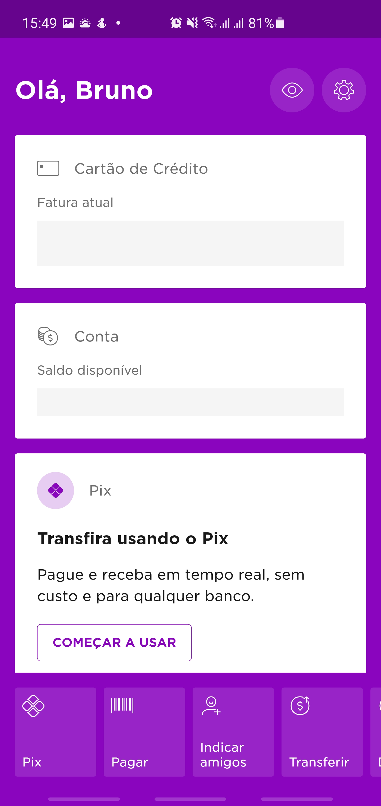
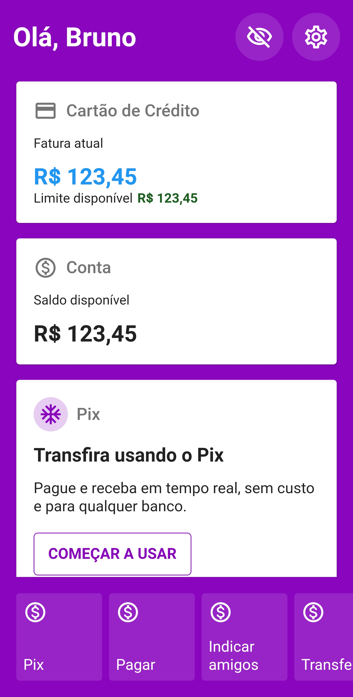

# Speed Coding - Nubank

Este projeto visa reproduzir a interface da tela inicial do aplicativo Nubank.

Como sempre, não há nenhum patrocínio envolvido e nenhum investimento externo de qualquer forma. O propósito deste repositório é puramente voltado para estudos.

  
  

## Getting Started

- Clonar o projeto
- Executar o comando `flutter pub get`
- Rodar o projeto
